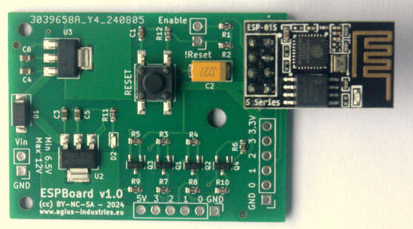
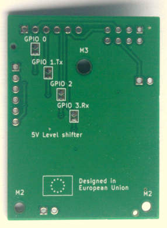

# ESPBoard

ESPBoard is a motherboard for ESP8266-01 with onboard voltage regulators and level shifters. 

It has been designed to be powered by fixed supply between 6V and 12V.

 

## Features

- Onboard 3.3V and 5V regulator.
- GPIO exposed at 3.3V and 5V with selectable level shifters.
- Reset switch.

## Manufacturing

See directory `Gerber/` for production files and bill of materials.

##  License

Copyleft 2024 - Nicolas AGIUS

Creative Commons - Attribution-NonCommercial-ShareAlike 4.0 International (CC BY-NC-SA 4.0)

